# 👋 Hey, I'm Yesvanth Vishva G

### 🤖 AI & Machine Learning Undergraduate | Java & Python Developer | Problem Solver

I'm a **B.Tech Artificial Intelligence & Machine Learning student** at **Panimalar Engineering College, Chennai**, passionate about building intelligent systems and solving real-world problems using **AI, Machine Learning, and Software Development**.

- 🎓 B.Tech AI & Machine Learning | 2023–2027
- 💻 Interested in Software Development, AI & Machine Learning
- 🤖 Passionate about building practical solutions using technology
- 🧠 Continuously improving my DSA, programming, and problem-solving skills
- 🚀 Exploring real-world applications of AI/ML

---

## 🛠️ Tech Stack

### 👨‍💻 Programming Languages

  
  
  

### 🌐 Web Development

  
  

### 🤖 AI / Machine Learning

  
  
  
  
  

### 🗄️ Database

  
  

### 🔧 Tools

  
  
  
  

---

## 🚀 Featured Projects

### 🖐️ Real-Time Sign Language Conversion into Text & Speech

An AI-powered system that recognizes sign language and converts it into **text and speech in real time**.

**Tech:** Python • Machine Learning • Computer Vision

🎯 **Accuracy: 85%+**

---

### 📄 AI Resume Screening & Job Matching System

An AI-based system designed to analyze resumes and compare them with job descriptions to generate a **resume-job compatibility score**.

**Tech:** Python • FastAPI • PostgreSQL • Scikit-learn • TF-IDF • Cosine Similarity

---

### 🅿️ Smart Parking System

A smart parking solution designed to improve parking-space utilization and reduce manual effort.

- 📈 Improved parking utilization by **30%**
- ⚡ Reduced manual effort by **40%**

**Tech:** Python • AI/ML • Database

---

### 💬 Sentiment Analysis

A machine learning project for classifying text sentiment from a large dataset.

- 📊 Processed **10,000+ samples**
- 🎯 Achieved **87% accuracy**

**Tech:** Python • NLP • Scikit-learn • Pandas

---

## 🏆 Achievements

🥇 **1st Prize** — ASIMOV 24 Debugging Contest

🥈 **2nd Prize** — IDEATHON | NutriMol-2026

💻 Active participant in coding, hackathons, and technical events

---

## 📜 Certifications

- ☁️ **Oracle Cloud Infrastructure** — AI Foundations
- 🌐 **Infosys** — Network Fundamentals
- 🤖 **TATA FORAGE** — GenAI Data Analytics Job Simulation
- 🗣️ **TCS iON** — Group Discussion

---

## 💻 Coding Profiles

---

## 🔗 Connect With Me

---

## 📊 GitHub Stats

## 📊 GitHub Stats

  
  

---

## 🔥 GitHub Contribution Streak

---

### 💡 "Keep Learning. Keep Building. Keep Improving."

⭐ **Thanks for visiting my profile!**
